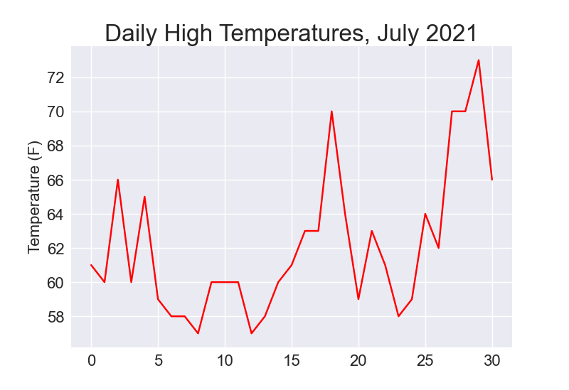
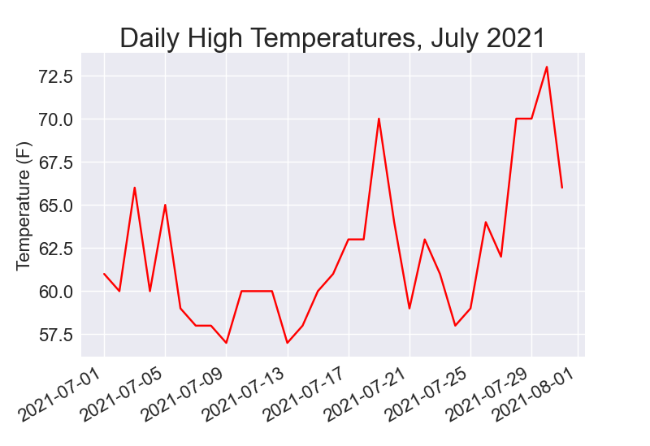
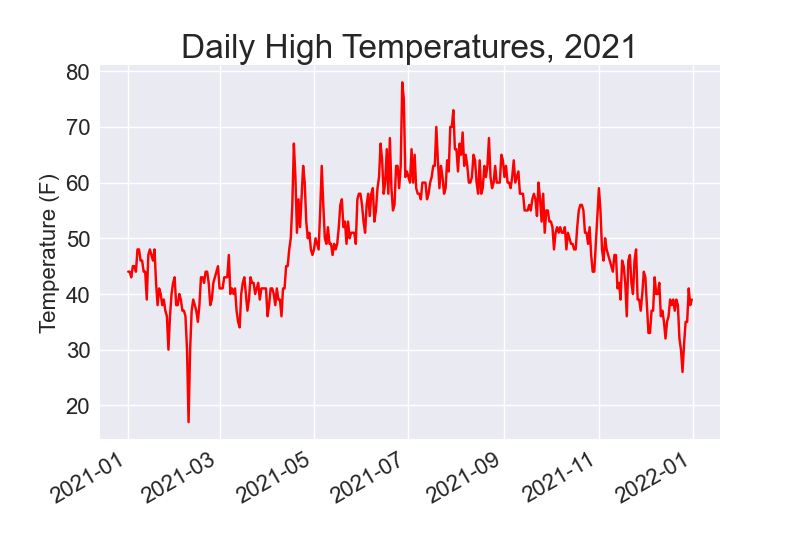
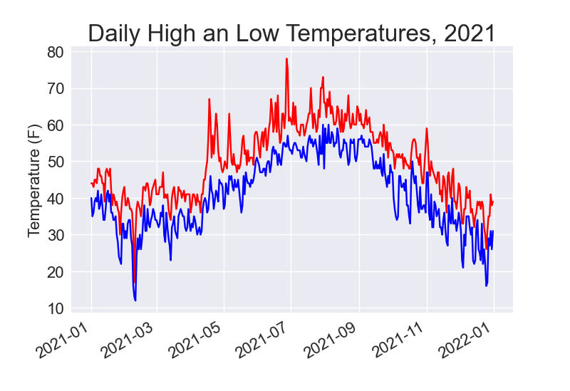
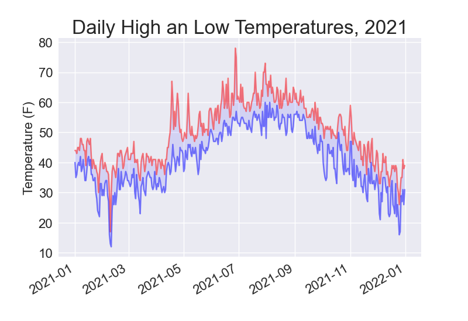
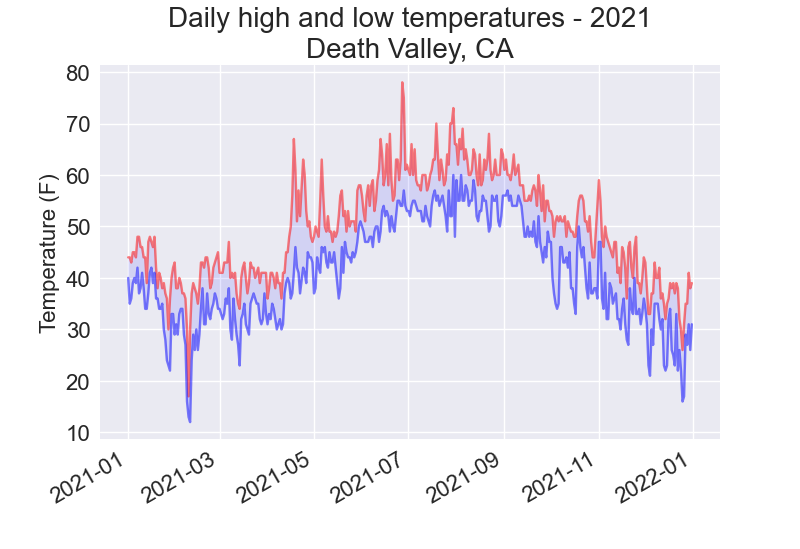
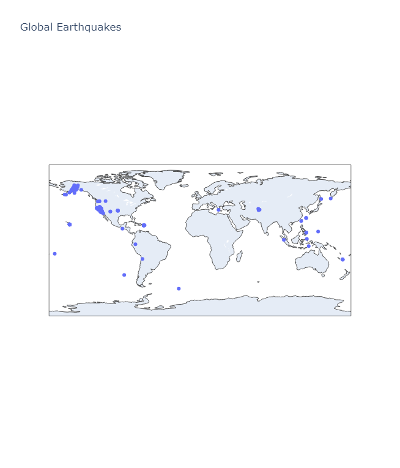
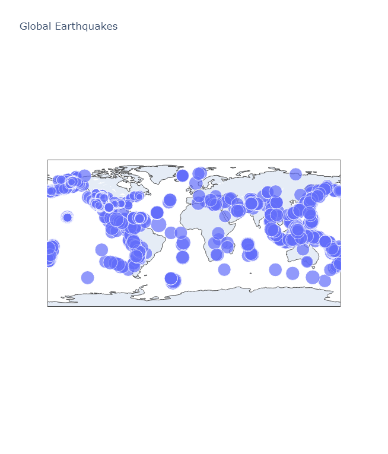
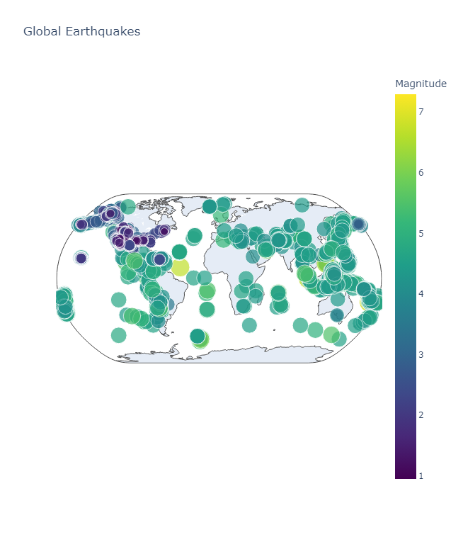
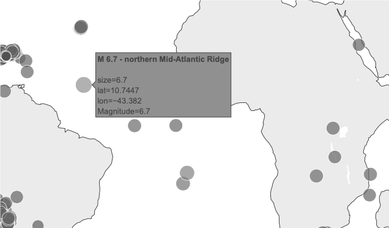

## Chapter 16 — DOWNLOADING DATA

This project was built while following *Python Crash Course* by Eric Matthes.  

“This chapter continues from previous data visualization projects. Required libraries (Matplotlib, Plotly, pandas) are assumed to be installed.”

---

### The CSV File Format

---

### Parsing the CSV File Headers

---

### Printing the Headers and Their Positions

---

### Extracting and Reading Data

---

### Plotting Data in a Temperature Chart

  
*Figure 16-1: A line graph showing daily high temperatures for July 2021 in Sitka, Alaska*

---

### The datetime Module

---

### Plotting Dates

  
*Figure 16-2: The graph is more meaningful, now that it has dates on the x-axis.*

---

### Plotting a Longer Timeframe

  
*Figure 16-3: A year’s worth of data*

---

### Plotting a Second Data Series

  
*Figure 16-4: Two data series on the same plot*

---

### Shading an Area in the Chart

  
*Figure 16-5: The region between the two datasets is shaded.*

---

### Error Checking

  
*Figure 16-6: Daily high and low temperatures for Death Valley*

---

### Downloading Your Own Data

---

## Mapping Global Datasets: GeoJSON Format

---

### Downloading Earthquake Data

### Examining GeoJSON Data

### Making a List of All Earthquakes

### Extracting Magnitudes

### Extracting Location Data

---

### Building a World Map

  
*Figure 16-7: A simple map showing where all the earthquakes in the last 24 hours occurred*

---

### Representing Magnitudes

  
*Figure 16-8: The map now shows the magnitude of all earthquakes in the last 30 days.*

---

### Customizing Marker Colors

  
*Figure 16-9: Color and size represent earthquake magnitude.*

---

### Other Color Scales

### Adding Hover Text

  
*Figure 16-10: Hover text shows a summary of each earthquake*

---

### Link to the Project Code

[Downloading Data GitHub Repository](https://github.com/jeanmarc-webdev/downloading-data)